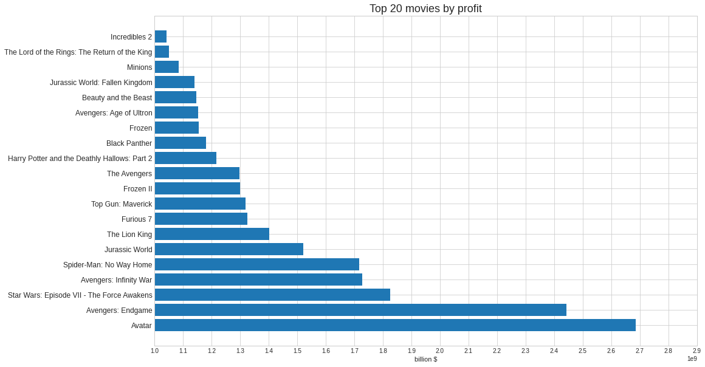
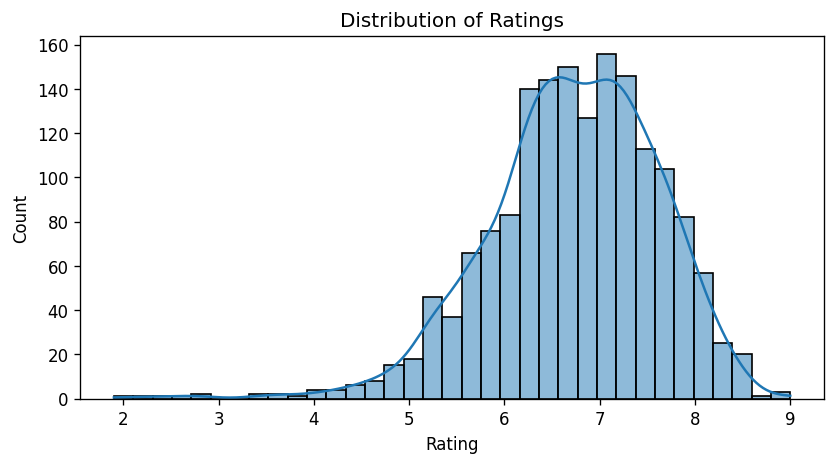
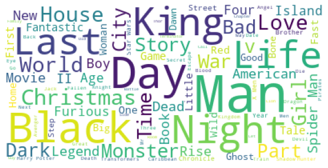

Exploratory Data Analysis on top 100 popular movies for each year from 2003 to 2022.  
Every single information from this dataset has been collected by web scraping and can be found on iMDB.  

The dataset contains:
+ Title
+ Rating
+ Year
+ Month
+ Certificate
+ Runtime
+ Director/s
+ Stars
+ Genre/s
+ Filming Location
+ Budget
+ Income
+ Country of Origin

Let's take a look at a few charts from the notebook

Wordcloud from the titles  

### [[KAGGLE]](https://www.kaggle.com/datasets/georgescutelnicu/top-100-popular-movies-from-2003-to-2022-imdb/code)
